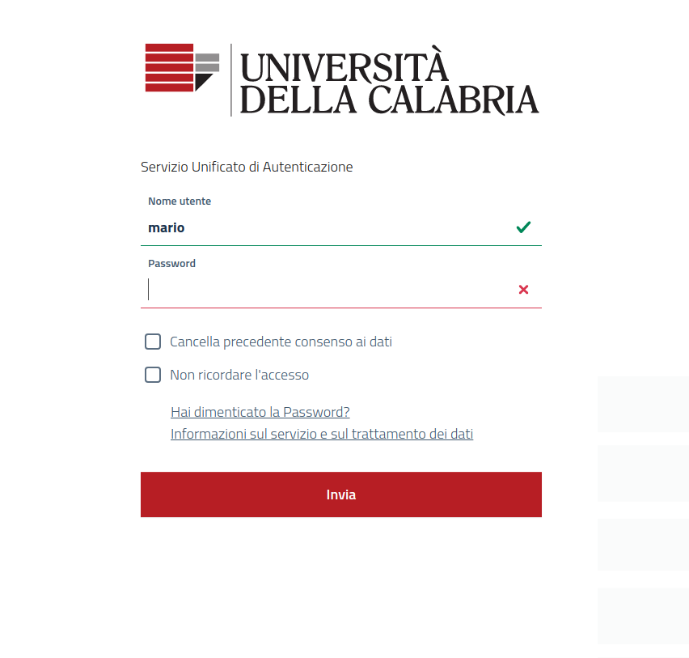

# Django uniAuth

Django Unified Authentication System is an IDentity Provider built on top of [IdentityPython](https://idpy.org) stack.

Consult the [Official Documentation at readthedocs](https://uniauth.readthedocs.io/en/latest/index.html) for specifications.

This Release implements a SAML2 IDP.

An OIDC Provider will be also available in the next release.

## SAML2 Features

uniAuth, as a SAML2 IDP, is based on [pysaml2](https://github.com/IdentityPython/pysaml2) and it supports:

- HTTP-REDIRECT and POST bindings;
- AuthnRequest with or without ForceAuthn;
- Encrypted assertions, customizable sign/digest algorithms and, in general, a good posture in terms of security and data integrity regarding SAML standards.

uniAuth doesn't support AllowCreate NameIDPolicy, this behaviour is completely demanded to uniAuth AttributeProcessors.

## Implementation specific Features

- Full Internazionalization support (i18n);
- Interactive Metadata Store definitions through the Admin Backend UI;
- Interactive ServiceProvider Federation through the Admin Backend UI;
- Customizable Template and style based on [AGID guidelines](https://www.agid.gov.it/it/argomenti/linee-guida-design-pa);
- MetadataStore and SP validations on save, to prevent faulty configurations in production environment;
- Optional and quite granular Agreement Screen;
- Many configurable options, for every SP we can decide:
    - signature and digest algorithms;
    - attributes release policies;
    - attribute rewrite and creation, fully configurable AttributeProcessors per SP, every aspect of attribute release can be customized from schratch;
    - selectable hashing algorithm for Computed NameID;
    - agreement screen message, availability, data consent form.
- Configurable log rotation through uwsgi;
- Importable StoredPersistentID for each user, for migrations from other IDP;
- An LDAP web manager with a configurable app (`ldap_peoples`);
- Multifactor support, as available in djangosaml2idp;
- Detailed but not huge logs.

## Contribute

Feel free to contribute creating separate PR from dedicated branches for each feature.
Open an Issue if you want to talk before develop to reduce the risk to be unmerged for some latest reason.
All the things will be collected in a new roadmap to the next release candidate.

Still need to handle Continuous Integration with unit test.

## Author

Giuseppe De Marco
