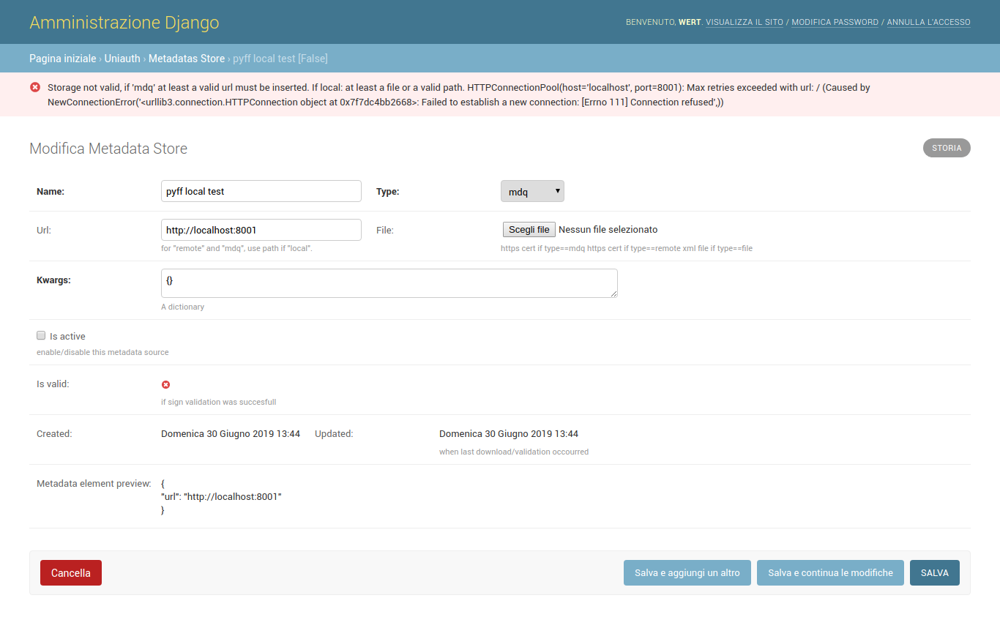
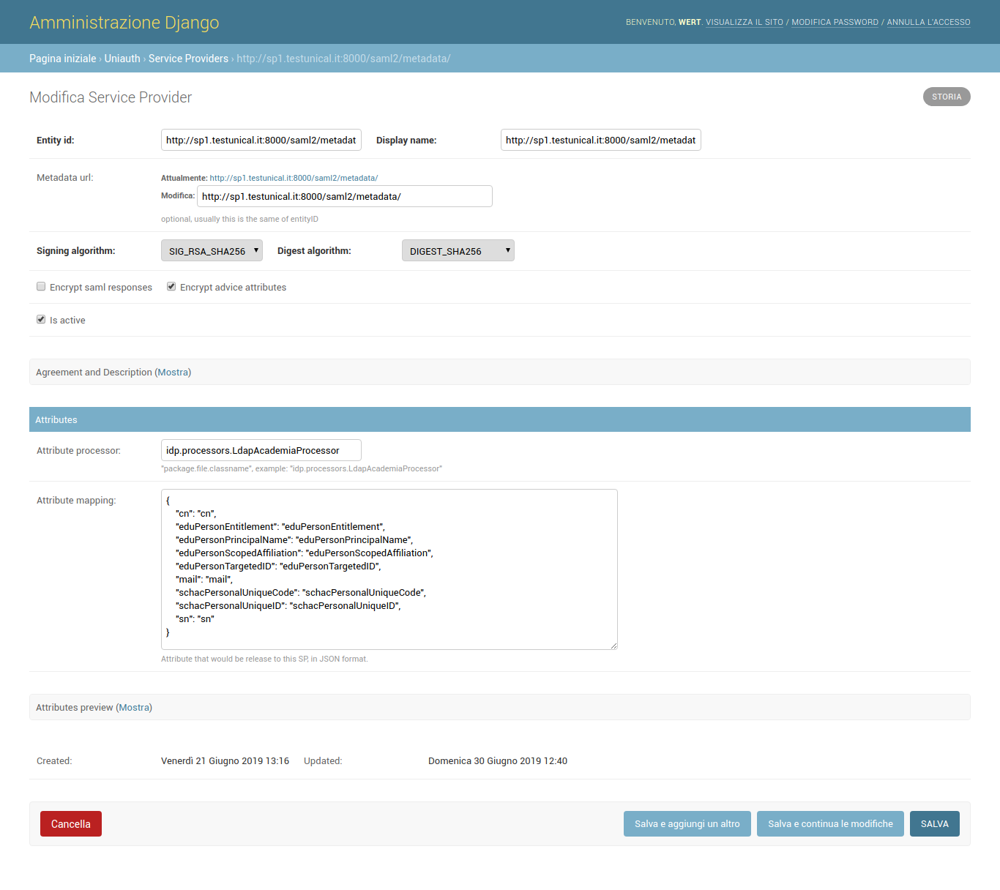

# Django uniAuth


**Django Unified Authentication System** is an *IDentity Provider* built on top of [IdentityPython](https://idpy.org) stack.
It was born as a fork of [djangosaml2idp](https://github.com/OTA-Insight/djangosaml2idp/) project of which very little has by now remained.

Consult the [Official Documentation at readthedocs](https://uniauth.readthedocs.io/en/latest/index.html) for usage specifications and advanced topics.


This Release implements a SAML2 IDP.

An OIDC Provider on top of [IdentityPython](https://idpy.org) will be also available in the next releases.

## SAML2 Features

uniAuth, as a SAML2 IDP, is based on [pysaml2](https://github.com/IdentityPython/pysaml2). Features:

- HTTP-REDIRECT and POST bindings  (signed authn request must be in HTTP-POST binding);
- ForceAuthn;
- SLO, SAML Single Logout;
- Signed and Encrypted assertions;
- AllowCreate, nameid is stored with a persistent nameid format.

## Implementation specific Features

- no restart is needed on new matadata store or SP;
- Full Internazionalization support (i18n);
- Interactive Metadata Store definitions through the Admin Backend UI;
- Interactive ServiceProvider definition through the Admin Backend UI;
- Customizable Template and style based on [AGID guidelines](https://www.agid.gov.it/it/argomenti/linee-guida-design-pa);
- MetadataStore and SP validations on save, to prevent faulty configurations in production environment;
- Configurable digest algorithm and salt for Computed NameID;
- Many configurable options, for every SP we can decide:
    - enable/disable explicitally;
    - signature and digest algorithms;
    - attributes release (force a set or release what requested by sp);
    - attribute rewrite and creation, fully configurable AttributeProcessors per SP, every aspect of attribute release can be customized from scratch;
    - agreement screen message, availability, data consent form.
- Configurable log rotation through uwsgi;
- Importable StoredPersistentID for each user, from migrations from another IDP;
- An optional LDAP web manager with a configurable app (`ldap_peoples`) through `django-ldap-academia-ou-manager <https://github.com/peppelinux/django-ldap-academia-ou-manager>`__;
- Multiple LDAP sources through `pyMultiLDAP <https://github.com/peppelinux/pyMultiLDAP>`__;
- Multifactor support, as originally available in djangosaml2idp;
- Detailed logs.


## Characteristics

uniAuth permit us to configure metadata store and federate new Service Providers directly from the Admin backend interface, via Web.
See [Official Documentation at readthedocs](https://uniauth.readthedocs.io/en/latest/index.html) for usage specifications and advanced topics.

---



*Every Metadata store, during creation or update, will be validated to avoid faulty configurations in production environment.*

---



*Define a new SP. If `SAML_DISALLOW_UNDEFINED_SP` is True this configuration is mandatory, otherwise only the sp metadata is needed.*

## Tests

````
pip install -r requirements-dev.txt
pytest tests/ -x --pdb
````

code coverage
````
coverage erase
coverage run -m pytest tests/
coverage report -m
````

A test LDAP server is available in `tests/ldapd.py`.
You can run it manually and test a query with `ldapsearch`.
Unit test will run `ldapd.py` automatically.

```
python3 tests/ldapd.py

ldapsearch -H ldap://localhost:3899 -b "dc=testunical,dc=it" -x uid=mario

# auth bind
ldapsearch -H ldap://localhost:3899 -b "dc=testunical,dc=it" uid=mario -D "uid=mario,ou=people,dc=testunical,dc=it" -w cimpa12
```

TODO:
- test logout, views: 858-914

## Contribute

Feel free to contribute creating separate PR from dedicated branches for each feature.
Please open an Issue if you want to talk before develop, to reduce the risk to be unmerged for some reason.

## Troubleshooting

````
AttributeError: module 'enum' has no attribute 'IntFlag'

pip uninstall -y enum34
````
